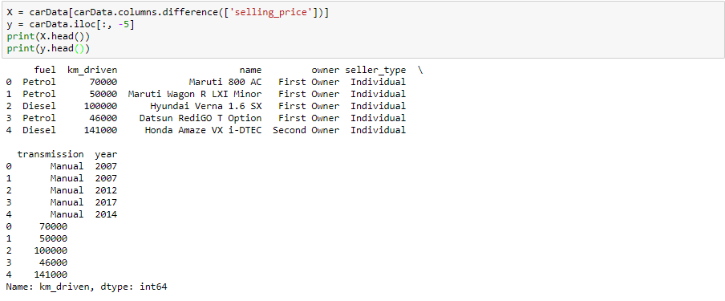
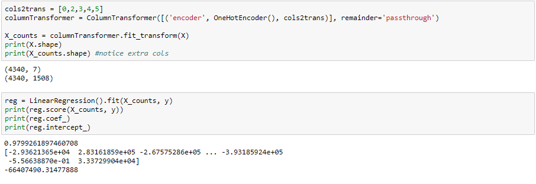
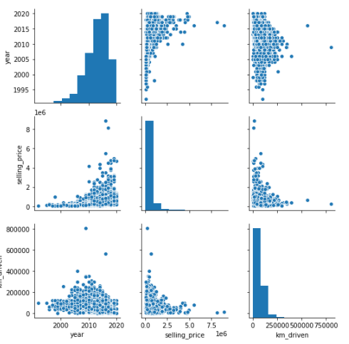
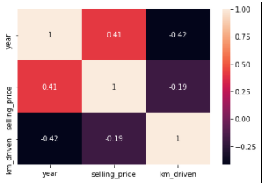
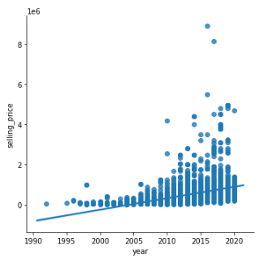
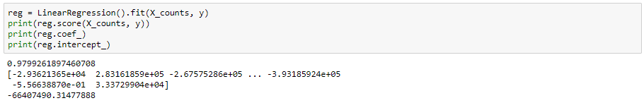
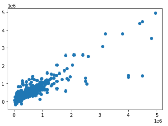
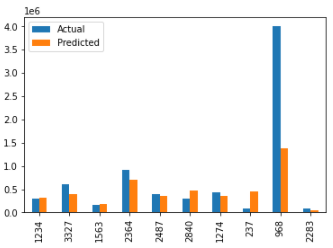

# Deployed Data Science State Employee analyzer

## Introduction

The objective this project is to analyze the prices of cars sold by car Dekho and determine how the price of a vehicle relates to the features and statistics of a vehicle. My teammate and I were interested in seeing how factors such as year made, km driven, fuel, seller, transmission and owner impact the price of a car you buy. Our goal was to deploy our findings to an app, but due to limited time, and balancing other projects on top of this one, that goal was sadly slightly out of reach. Although, this motivation was inspired by the [pycaret post](https://towardsdatascience.com/build-and-deploy-machine-learning-web-app-using-pycaret-and-streamlit-28883a569104)[1].

As briefly mentioned above, this project was inspired by our curiosity of how second hand vehicles are priced. Both members of our team have an interest in cars and thought this would be a project that would maintain our interest and possibly prove useful when buying a car post graduation. To analyze my dataset, I'll be utilizing numpy/panda and scikit.

## Selection of Data

The model processing and training were conducted using a Jupyter Notebook and are available [here](https://github.com/serpawatwit/-dsFinal/blob/main/Car%20Data.ipynb). The dataset we utilized was obatained through Kaggle. The link to the owner of this dataset is [here](https://www.kaggle.com/nehalbirla/vehicle-dataset-from-cardekho)[2].

This dataset consists of 4,340 entries that consist of the cars that are currently listed on the cardekho's website. Each data point also resides within 8 columns. These columns are; Name, Year, Selling_Price, Km_driven, Fuel, Seller_Type, Transmission and Owner. If you wish to see the website that the cars within this dataset are found click [here](https://www.cardekho.com/)[3].

The dataset .csv file can be found online at [git](https://github.com/serpawatwit/-dsFinal/blob/main/CAR%20DETAILS%20FROM%20CAR%20DEKHO.csv) as well. 

Data preview:

The data we are working with has categorical data in 5 of the columns. These columns are Fuel, Name, Owner, Seller_Type and transmission.
To handle this data I used the sample project provided by our professor, click [here](https://github.com/memoatwit/dsexample)[4] to see, as reference. Due to this decision, OneHotEncoder/ColumnTransformer on these features and kept the rest of the features as is.

We then used a linear regression model to to identify the learning accuracy using the transformation previously mentioned.

Linear Regression Preview:

## Methods

Tools:
- Seaborn, numpy, panda, and sklean for data analysis
- Github for project repo

Inference Methods used with Scikit:
- linear regression model
- Features: OneHotEncoder/ColumnTransformer and train_test_split

## Results

We want to preface our results by refering everyone to [this](https://acadgild.com/blog/linear-regression-on-boston-housing-data)[5] webpage. This is a dataset that is used to predict the cost of Boston housing. We looked at this file and took a lot away in terms of which graphs to use and how to properly create them. It was an invaluable resourse.

Originally, I simply used pairplot to see the relationships between all the features in the dataset.

Pairplot:

From there, I used a heatmap to determine which column had the highest correlation (which was only 0.41) with selling_price, which was year. Working off of this finding, we utilized a lmplot to plot these two columns to demonstrate their relationship

Heatmap:

lmplot:

We also used Linear Regression to determine the coefficient of the prediction, when using selling_price as the independent variable and all others as dependent variables, which was 0.9799261897460708

Linear Regression:

Finally, we utilized sklearn train_test_split to train the model with 80% of the data and then test the data against the remaining 20% of the data. From here, we used this linear regression model to predict the cost of a vehicle given the features defined in the dataset. Finally, we plotted our predictions and compared them to the acutual values.

Prediction Scatter Plot

Prediction vs Actual Bar Plot

## Discussion

After a lot of trial and error, we found that for this problem linear regression was, by far, our best bet in conjunction with one-hot encoding for the columns that were not quantitative. From here, we trained the model with a data split of 80/20. This resulted in a 66% training accurracy. We also ended up having a test accuracy of 98.7%.

After getting these results, we attempted to find similar tests on the same dataset on Kaggle, but were unable to find any. Hopefully, in the future, we will be able to expand our dataset to other dealers and see if the trend persists.

THe greatest challenge of this project didn't have much to do with the work itself. It more-so had to do with being able to balance our finals schedule and other projects. One of us had 3 other projects and two final exams that required just as much attention as this project. Being able to balance this work is something we could 1005 improve on in the future.

## Summary

This project uses a supervised regression model to predict the cost of cars based off of 7 complementary columns. The model hovers around an extremely high 97% for the test data.

Although we were unable to deploy this project in time for the presentation, we intend on deploying it at some point because we believe it will be invaluable to have a project like this in our portfolio.

Beyond that, this project would have been impossible without the tools and references we had. We highly recommend taking a moment to take a look at them and read them over, especially [this](https://acadgild.com/blog/linear-regression-on-boston-housing-data)[5] one since it was the one we referenced the most.

## References

[1] [pycaret post](https://towardsdatascience.com/build-and-deploy-machine-learning-web-app-using-pycaret-and-streamlit-28883a569104)

[2] [Car Cost Dataset](https://www.kaggle.com/nehalbirla/vehicle-dataset-from-cardekho)

[3] [Dataset Raw Source](https://www.cardekho.com/)

[4] [Dsexample Project](https://github.com/memoatwit/dsexample)

[5] [Linear Regression on Boston Housing data](https://acadgild.com/blog/linear-regression-on-boston-housing-data)
